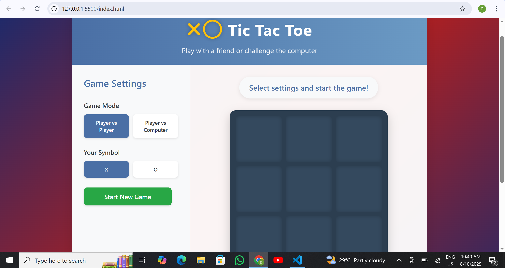

# Elegant Tic Tac Toe
An interactive and modern Tic Tac Toe game built using HTML, CSS, and JavaScript with a sleek, responsive UI.
Play against a friend (Player vs Player) or challenge the computer (Player vs Computer) with adjustable difficulty levels.

# Overview
This web-based game features a clean, elegant design and smooth gameplay.
It supports different game modes, animated winning highlights, and post-game prompts to restart or reset the game.

# Key Features
i)- Two Game Modes: Player vs Player & Player vs Computer (Easy, Medium, Hard)

ii)- Elegant UI with animations and highlights

iii)- Responsive Design for mobile and desktop

iv)- Restart or Reset after a match ends

v)- Winning pattern highlighting

vi)- Custom modal prompt after win/draw

# Functionalities
-> Choose game mode and symbol (X or O)

-> Computer AI with difficulty settings

-> Player X always starts the game

-> Automatic detection of win, draw, or ongoing game

-> Restart with same settings or reset to defaults.

# Preview

# Project Structure
       tic-tac-toe/
           │── index.html        # Main HTML file
           │── style.css         # Stylesheet
           │── script.js         # Game logic
           │── assets/           # Images and preview
           │    └── preview.png
           └── readme.md         # Project documentation

# Future Enhancements
i)- Theme toggle (light/dark mode)

ii)- Scoreboard / Player history

iii)- Sound effects for moves & wins

# License
Licensed under the MIT License — free to use, modify, and distribute.

# Contribution
Contribution and new ideas are open for this repository.

